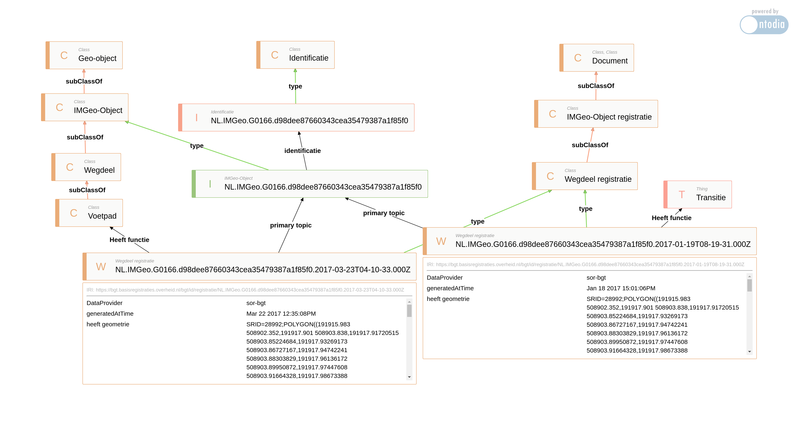

## De BGT-LD uitleg die ik had willen hebben...

Naar aanleiding van de lancering van de BGT als Linked data wilde ik kijken of ik er wat moois mee kon. Bijvoorbeeld de demo's die we eerder
gemaakt hebben op prototypes van de BGT 'upgraden' naar het nieuwe endpoint.

Dat bleek nog niet zo makkelijk omdat er een aantal ontwerpbeslissingen genomen zijn, die weliswaar erg terecht zijn, maar die niet direct duidelijk waren voor mij...

### BGT/IMGeo en NEN3610

Vanuit de BGT/IMGeo zijn we gewend om eigenlijk alleen naar de BGT/IMGeo objecttypen te kijken.

In de opgestelde ontologie is het NEN3610 topmodel ook opgenomen. Dit maakt het plaatje natuurlijk completer, maar betekend ook dat bijvoorbeeld een bgt:BegroeidTerreindeel nu ook gemapt is aan nen3610:Terrein.

### Strikte scheiding tussen de registratie en de definities

Ik was in eerste instantie op zoek naar instances van het type Wegdeel, en die kon ik niet vinden... Dat komt omdat Wegdeel de definitie van 'het ding buiten in de werkelijkheid' is en WegdeelRegistratie het 'ding in de registratie'. Eigenlijk best logisch... 

### Onderscheid tussen de registratie van het object, de nen3610 identificatie en de 'metadata' van het object

Er is dus een WegdeelRegistratie met prefix 'registratie' <https://bgt.basisregistraties.overheid.nl/bgt/id/registratie/> <br>
een nen3610 identificatie met de prefix 'identificatie' <https://bgt.basisregistraties.overheid.nl/bgt/id/identificatie/> <br>
en een metadata object met de prefix 'object' <https://bgt.basisregistraties.overheid.nl/bgt/id/object/> <br>
het model zelf (classes en properties) heeft de prefix 'bgt' <https://bgt.basisregistraties.overheid.nl/bgt/def/> 

### alle mutaties aan de registratieobjecten zijn opgenomen in de graph

In de registratieobject zijn alle mutaties aan het object opgenomen, deze hebben een unieke URI gekregen op basis van het NEN3610 ID plus de timestamp van het tijdstipregistratie.
* tijdstipregistratie en eindregistratie zijn gemapt op prov:generatedAtTime en prov:invalidatedAtTime
* Om het huidige object te vinden moet je dus filteren op het object dat geen prov:invalidatedAtTime heeft:

```filter not exists {?reg prov:invalidatedAtTime [] .}```

### Geometrie is in RD opgenomen in het bgt attribuut bgt:geometrie met als serialisatie WKT

Ik wilde al aan de slag met de standaard Geosparql hasGeometry/asWKT constructie, maar dat werkt dus anders.
En even opletten dat de meeste online tools WGS84 verwachten, dus niet vegreten je geometrie te transformeren van RD -> WGS84

```bind(bif:ST_Transform(?geomRD, 4326) as ?geomWGS)```

### inzichtelijk gemaakt...

In ondderstaand plaatje is de structuur inzichtelijk gemaakt.

* Aan de linkerkant zie je de ontologie hierarchie van nen3610:Geo-object -> bgt:IMGeo-Object -> Wegdeel -> Voetpad
* In het midden het nen3610:Identificatie object
* Aan de rechterkant het foaf:Document -> bgt:IMGeo-ObjectRegistratie -> WegdeelRegistratie
* Onderin zie je 2 instanties van een Wegdeel registratie. de rechter is inmiddels vervallen en had een functie 'Transitie', de linker is het huidige object met de functie 'Voetpad'.
* je ziet dus dat de URI's van de Wegdeelregistratie instanties uniek zijn met een timestamp erin, en dat ze allebei naar de IMGeo Object instantie wijzen met de Identificatie als URI. 
* Om te 'koppelen' met de BGT-LD vanuit je eigen systeem (waar je over het algemeen de Identificatie hebt...) Moet je dus 'binnenkomen' op het IMGeo-Object en vandaar uit doorgaan naar het actuele registratie object...


